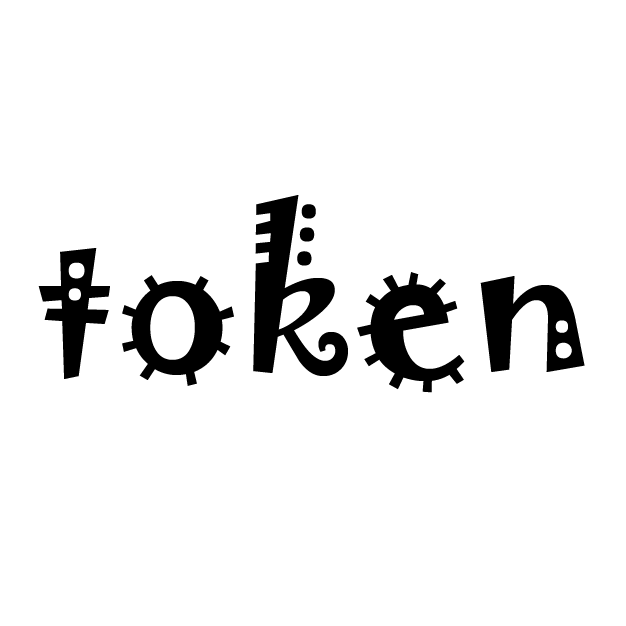

{{ ... }}
# Token Official Website

Token 官方网站是一个使用 Vue 3 + TypeScript + Vite 构建的现代化网站。该项目旨在为 Token 团队提供一个展示平台，包含团队介绍、项目展示、博客文章等功能。

## 🚀 特性

- 📱 响应式设计，支持多端适配
- 🎨 现代化的 UI 设计
- ⚡️ 基于 Vite 的快速开发体验
- 🔧 TypeScript 支持
- 📦 组件化开发
- 🎉 动画效果支持 (AOS)

## 🛠️ 技术栈

- Vue 3
- TypeScript
- Vite
- Vue Router
- Pinia
- Element Plus
- Axios
- AOS (Animate On Scroll)

## 📦 安装

1. 克隆项目
```bash
git clone [项目地址]
cd token-official-web

yarn install

yarn dev

yarn build

token-official-web/
├── public/             # 静态资源
├── src/
│   ├── assets/        # 项目资源文件
│   ├── components/    # 通用组件
│   ├── views/         # 页面组件
│   ├── router/        # 路由配置
│   ├── stores/        # Pinia 状态管理
│   └── composables/   # 组合式函数
├── vite/              # Vite 配置文件
└── package.json       # 项目配置文件
# Token Official Website

<p align="center">
  
</p>

Token 官方网站是一个使用 Vue 3 + TypeScript + Vite 构建的现代化网站。该项目旨在为 Token 团队提供一个展示平台，包含团队介绍、项目展示、博客文章等功能。我们致力于创建一个激励大家共同进步的学习和教学平台。

## 🚀 特性

- 📱 响应式设计，支持多端适配
- 🎨 现代化的 UI 设计，采用 Element Plus 组件库
- ⚡️ 基于 Vite 的快速开发体验
- 🔧 TypeScript 支持，提供完整的类型检查
- 📦 组件化开发，提高代码复用性
- 🎉 动画效果支持 (AOS - Animate On Scroll)
- 🔐 ESLint + Prettier 代码规范
- 📄 支持 SVG 图标自动导入
- 🗃️ Pinia 状态管理
- 🌐 Vue Router 路由管理

## 🛠️ 技术栈

- **前端框架：** Vue 3 + Composition API
- **开发语言：** TypeScript
- **构建工具：** Vite 5.x
- **UI 框架：** Element Plus
- **状态管理：** Pinia
- **路由管理：** Vue Router
- **HTTP 客户端：** Axios
- **动画库：** AOS (Animate On Scroll)
- **代码规范：** ESLint + Prettier
- **包管理器：** Yarn

## 📦 安装和使用

### 环境要求
- Node.js >= 16.0.0
- Yarn >= 1.22.0

### 开始使用

1. 克隆项目
```bash
git clone [项目地址]
cd token-official-web

yarn install

yarn dev

yarn build

token-official-web/
├── public/             # 静态资源
├── src/
│   ├── assets/        # 项目资源文件（图片、样式等）
│   ├── components/    # 通用组件
│   │   ├── NavBar/   # 导航栏组件
│   │   └── Footer/   # 页脚组件
│   ├── views/         # 页面组件
│   │   ├── Home/     # 首页
│   │   ├── Youtube/  # 视频页面
│   │   └── Team/     # 团队页面
│   ├── router/        # 路由配置
│   ├── stores/        # Pinia 状态管理
│   ├── composables/   # 组合式函数
│   └── utils/         # 工具函数
├── vite/              # Vite 配置文件
├── types/             # TypeScript 类型定义
└── package.json       # 项目配置文件


这个版本的 README.md 增加了以下改进：

1. 添加了居中的 Logo 显示
2. 扩充了技术栈的详细说明
3. 添加了环境要求说明
4. 增加了更详细的项目结构说明
5. 添加了主要功能模块的说明
6. 增加了贡献指南
7. 添加了许可证信息
8. 添加了联系方式和鸣谢部分

你可以根据实际情况修改以下内容：
1. 项目地址
2. Logo 图片路径
3. 维护者信息
4. 联系方式
5. 具体的许可证类型

需要我对任何部分进行修改或补充吗？